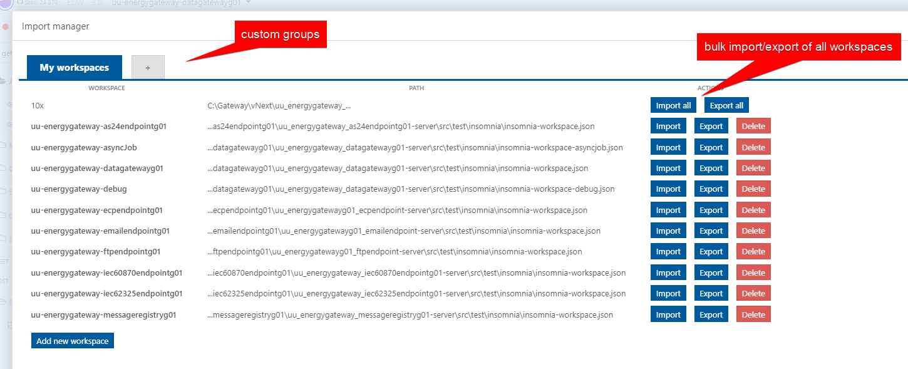
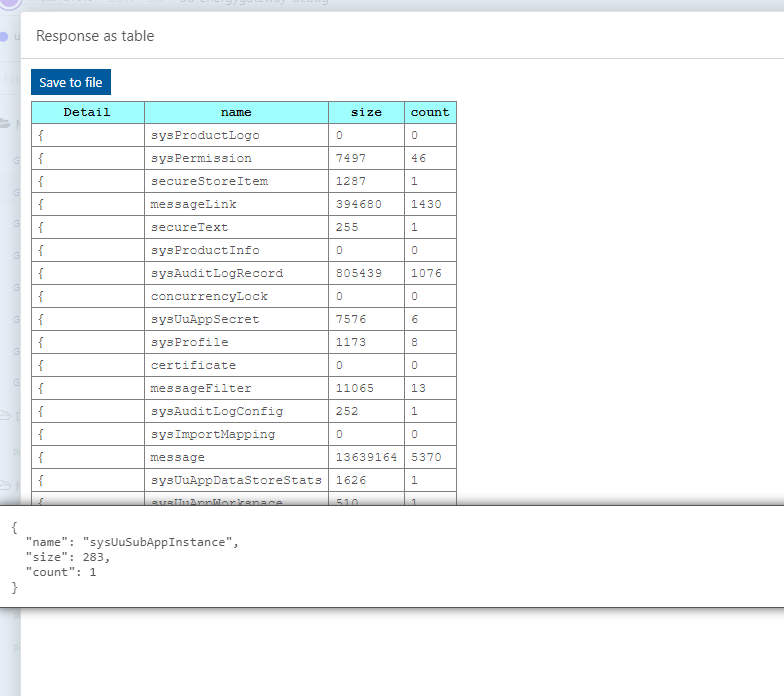

# Insomnia uuSync Plugin

This plugin can...

1. ... connect workspaces to its exported file path, import them, export them by import manager
2. ... show response array as table

**Warning**: This plugins was tested in version 2022.5.0. Previous version are not full supported.

## Import manager

In workspace menu there are three actions:

1. Export workspace - exports actual workspace to connected file path
2. Import workspace - re import actual workspace from conncted file path
3. Import manager - show dialog with management of workspaces. Supports importing/exporting, groups of workspaces, bulk operations.

Exported workspace is formatted and splitted to files for every request to be versioned by GIT. These files are less prone to collisions. Compatible insomnia-workspace.json is also generated to be used with Insomnia without uuSync plugin. In case of collision in insomnia-workspace.json revert changes, import by uuSync and export again.

## Table data viewer

1. Execute some request that returns some array or some object with some property that returns array.
2. Click on workspace menu and on "Show response as table"
3. Data are showed in table and can be also exported to file.

